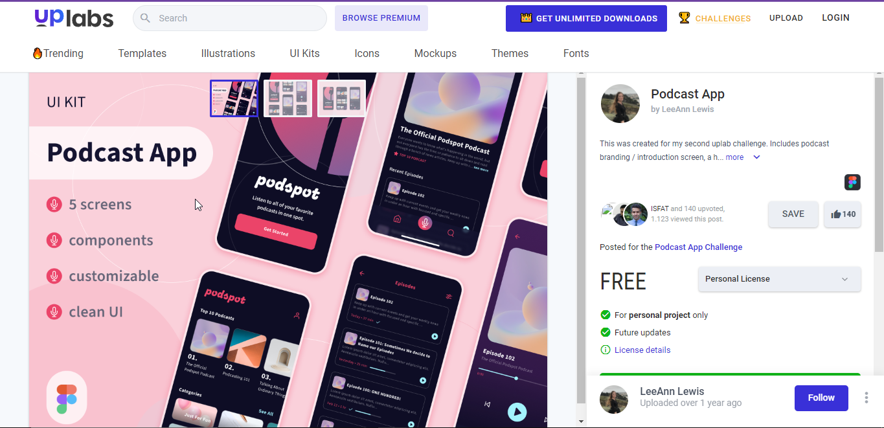
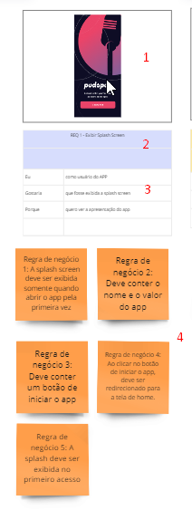
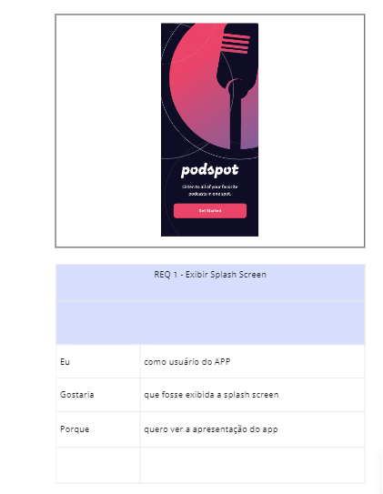
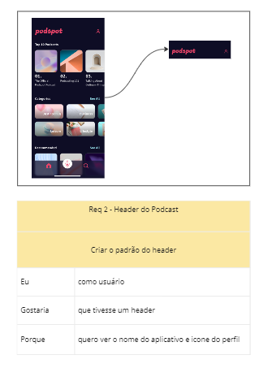
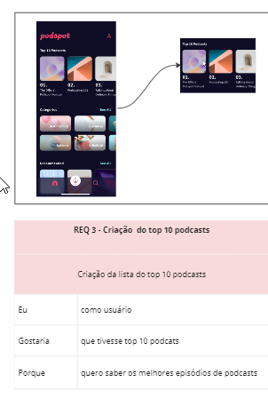
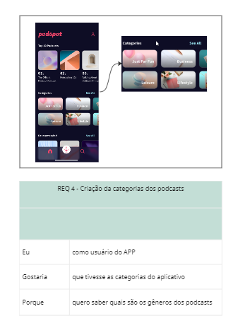
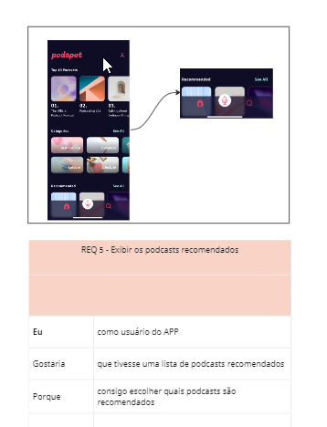
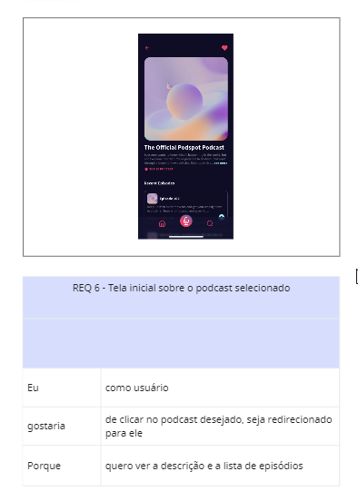
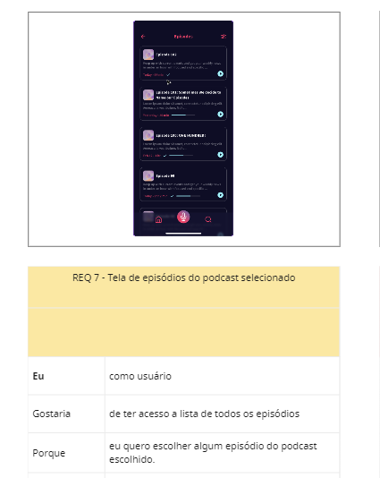
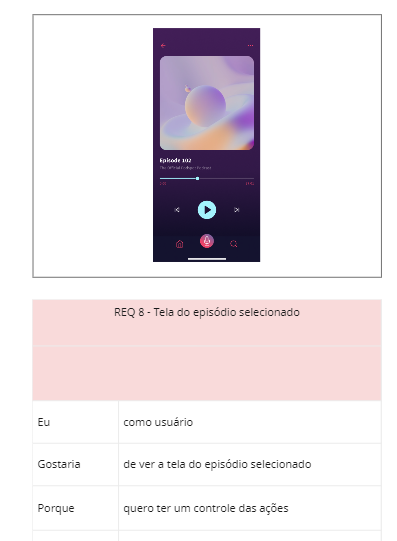

# Projeto Podcast APP

Este projeto foi criado com o propósito de praticar o **levantamento de requisito** de um projeto, onde foi levado em consideração analisar um projeto do tipo Figma retirado do site UpsLabs que vários designers tem a possibilidade de subir seus projetos.

Com isso, irei demonstar a análise do projeto PodcastApp através do protótipo será analisado os requisitos desejavéis para este projeto.

## Protótipo
- Protótipo do Figma [PodcastApp](https://www.uplabs.com/posts/podcast-app-27e7dba2-b5d6-40f8-be0f-52d6710b9af7)

## Análise do Projeto
A imagem abaixo indiará como foi feita a análise deste projeto, onde foi utilizado o **Miro** para análise de forma visual.

1. Indicação da imagem a ser analisada
2. Indicação de qual requerimento iremos analisar, indicando seu número e nome.
3. Descrição em alto nivel da funcionalidade, indicando o usuário que irá utilizar, a funcionalidade deseja e a razão da existência desta funcionalidade.
4. Listagem das regras de negócio a serem implementadas.

### Referência da Análise

- REQ 1: Exibir Splash Screen

| Número da Regra de Negócio | Descrição |
| --- | --- |
| 1   | A splash screen deve ser exibida somente quando abrir o app pela primeira vez |
| 2   | Deve conter o nome e o valor do app |
| 3   | Deve conter um botão de iniciar o app |
| 4   | Ao clicar no botão de iniciar o app, deve ser redirecionado para a tela de home | 
| 5 | A splash deve ser exibida no primeiro acesso | 

- REQ 2: Header do Podcast

| Número da Regra de Negócio | Descrição |
| --- | --- |
| 1   | Ter o nome do podcast no header | 
| 2   | Ter o icone de perfil no header |

- REQ 3: Criação  do top 10 podcasts

| Número da Regra de Negócio | Descrição |
| --- | --- |
| 1   | Mostrar o nome dos melhores podcasts até o 10º |
| 2   | Mostrar o nome e foto do podcast |

- REQ 4: Criação da categorias dos podcasts

| Número da Regra de Negócio | Descrição |
| --- | --- |
| 1   | Exibir a lista de categorias dos podcasts |
| 2   | Deve ser exibido o nome e a foto da categoria | 
| 3   | Não deve ter nome repetido | 
| 4   | O usuário deve conseguir puxar a lista na horizontal |
| 5   | Na parte da categoria, deve ter um botão de "See all" para exibir TODAS as categorias. | 

- REQ 5: Exibir os podcasts recomendados

| Número da Regra de Negócio | Descrição |
| --- | --- |
| 1   | Exibir uma lista dos podcasts mais recomendados |
| 2   | Mostrar a foto e nome  dos podcasts recomendados | 
| 3   | O usuário deve conseguir puxar a lista na horizonta | 
| 4   | Deve ter botão de "See all" |

- REQ 6: Tela inicial sobre o podcast selecionado

| Número da Regra de Negócio | Descrição |
| --- | --- |
| 1  | Exibir o nome do podcast e a descrição sobre o podcast |
| 2 | Exibir se o podcast é top 10 ou não |
| 3 |  Exibir a lista de todos os episódios do podcast |
| 4 | Exibir a opção de "See more" se a descrição do podcast for grande |
| 5 | Exibir um botão de voltar para a tela inicial |
| 6 | Regra de negócio 6: Exibir um botão de coração para favoritar o podcast |
| 7 | Na lista dos episódios, deve ser exibido o número do episódio, descrição e a opção de clicar para tocar | 
| 8  |  Deve haver um limite de caracteres para a descrição. | 
| 9 | O botão de See More deve ter uma cor diferente. |

- REQ 7: Tela de episódios do podcast selecionado

| Número da Regra de Negócio | Descrição |
| --- | --- |
| 1   | Exibir o nome do podcast e a descrição sobre o podcast | 
| 2   | Exibir se o podcast é top 10 ou não | 
| 3   | Exibir a lista de todos os episódios do podcast | 
| 4  | Exibir a opção de "See more" se a descrição do podcast for grande | 
| 5  | Exibir um botão de voltar para a tela inicial | 
| 6  | Exibir um botão de coração para favoritar o podcast | 
| 7  | Na lista dos episódios, deve ser exibido o número do episódio, descrição e a opção de clicar para tocar |
| 8   | Deve haver um limite de caracteres para a descrição | 
| 9  | O botão de See More deve ter uma cor diferente | 
| 10  |  O botão de play deve ter uma cor diferente |
| 11  | Quando clicar no botão de see more na descrição, deve ser exibido toda a descrição do podcast |
| 12  | Quando algum episódio novo for adicionado na lista, deve ser exibido |
| 13  | Se o podcast não estiver no top 10, não exibir a top 10 podcast | 
| 14 | O botton menu deve ter o bottom colorido porque está na tela do podcast | 

- REQ 8: Tela do episódio selecionado

| Número da Regra de Negócio | Descrição |
| --- | --- |
| 1   | Exibir o botão de voltar | 
| 2   | Exibir o titulo da página | 
| 3   | Deve ter uma lista de TODOS os episódios | 
| 4   | Deve ter um icone para filtrar os episódios |
| 5   | Na lista do episódios, deve ter uma caixa separando as informações de cada episódio |
| 6   |  Na caixa do episódio, deve ser exibido a image, nome, descrição, duração, se o episódio foi exibido ou não | 
| 7  | Deve ter um botão de play para tocar o episódio escolhido | 