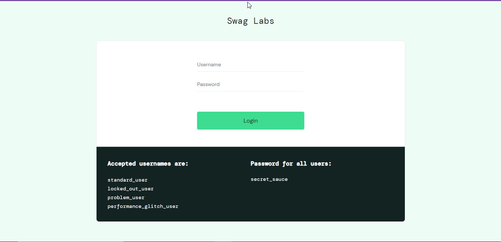
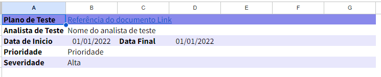
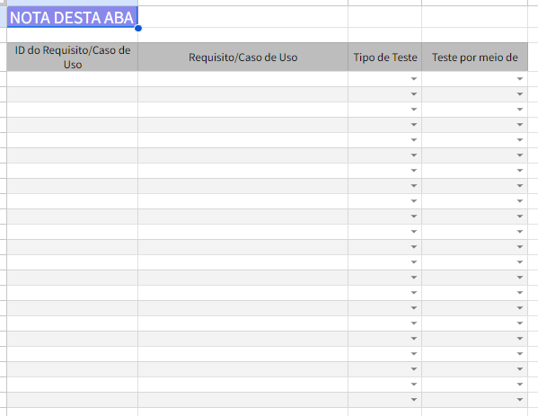
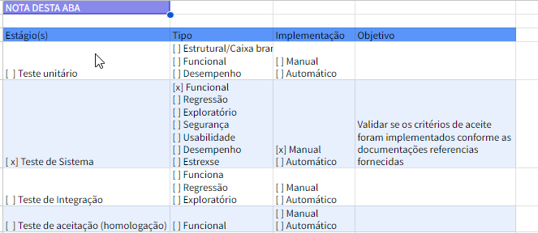
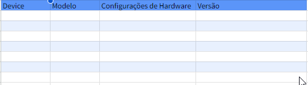
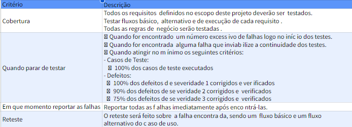
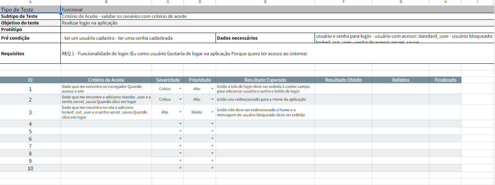

# Projeto Podcast APP

Este projeto foi criado com o propósito de praticar a criação e execução do **Plano de teste** de um projeto, onde foi levado em consideração analisar um site já existentes, realizar levantando os seus requisitos, criação de suites e casos de testes para execução

## Ferramentas
- Site utilizado para a elaboração do Plano [SauceDemo](https://www.saucedemo.com/)

- Excel para criação do Plano de teste:

## Plano de Teste

### Apresentando a Introdução
Na aba Introdução da Planilha, ira conter todas as informações bases do projeto.

### Apresentando o Escopo do Teste
Na aba de Escopo de Teste, irá conter todas as informações necessárias dos critérios de aceite para tratar.

Entre eles: 
- **Id do Requisito/Caso de Uso**: será colocar a número do requerimento
- **Requisito/Caso de Uso**: será colocado a descrição do cenário de teste.
- **Tipo de Teste**: será colocado a forma o tipo de teste, se é unitário, componente e entre outros.
- **Teste por meio de**: será colocado a informação a forma que será testado, se é script, caso de teste e entre outros.

### Apresentando a estratégia de teste:
Na aba de Estratégia de Teste, terá todas as informações sobre o planejamento do tipo de teste que você estará fazendo dentro da aplicação.

Entre elas:
- **Estágio(s)**: descrição sobre o tipo de teste que será aplicado.
- **Tipo**: classificação do tipo de teste dentro da opção escolhida.
- **Implementação**: a forma que o teste será implementado dentro da fase de teste.
- **Objetivo**: descrição de qual é a finalidade do teste.

### Apresentando o ambiente do teste: 
Na aba de Ambiente do teste, é caracterizado como a descrição do ambiente que será testado.

Entre eles:
- **Device**: escolha de qual dispositivo foi executado o teste.
- **Modelo**: modelo do dispositivo onde o teste foi executado.
- **Configurações do Hadware**: quais são as especificações do dispositivo que executou o teste.
- **Versão**: qual é a versão do dispositivo que executou o teste.

## Apresentando o Critério de Aceite:
Na aba de Critério de Aceite, irá conter todas as informações necessárias como funciona a cobertura de teste, quando devemos parar de testar  quando devemos reportar as falhas. Além disso, mostra o padrão de qualidade do projeto para o cliente.

Entre eles:
- **Critério**: mostram os critérios exibidos para o critério de aceite.
- **Descrição**: mostra o significado de cada parâmetro da aba de critério de aceite.

### Apresentando a suite
Na aba Suite_(nome do requisito), irá conter todas as informações necessárias para execução dos testes vinculadas a Suíte.

Entre eles:
- **Objetivo do teste**: qual é a finalidade do teste que está sendo executado.
- **Tempo de execução**: é o quantidade de tempo gasto que você leva para escrever esse teste.
- **Pré-condição**: o que é necessário para executar para chegar na suite de teste
- **Dados necessários**: os dados necessários para executar o teste.
- **Critério de aceite**: é o comportamento esperado do caso de teste o qual foi levantando.
- **Requisitos**: quais são os requisitos necessários para escrever o critério de aceite.
- **Tipo de teste**: qual é o tipo de teste que será realizado.
- **Prioridade**: descreve qual é a prioridade daquele cenário, ou seja, o quão urgente é necessário testar aquele cenário.
- **Severidade**: descreve qual é o impacto daquele cenário na aplicação.
- **Resultado Esperado**: seria o comportamento correto dentro da aplicação.
- **Resultado obtido**: descrição do comportamento obtido durante a execução do teste.
- **Defeitos**: descrição do problema encontrado durante a execução do teste. 
- **Finalizado**: descrição se o caso de teste já foi executado ou não.

